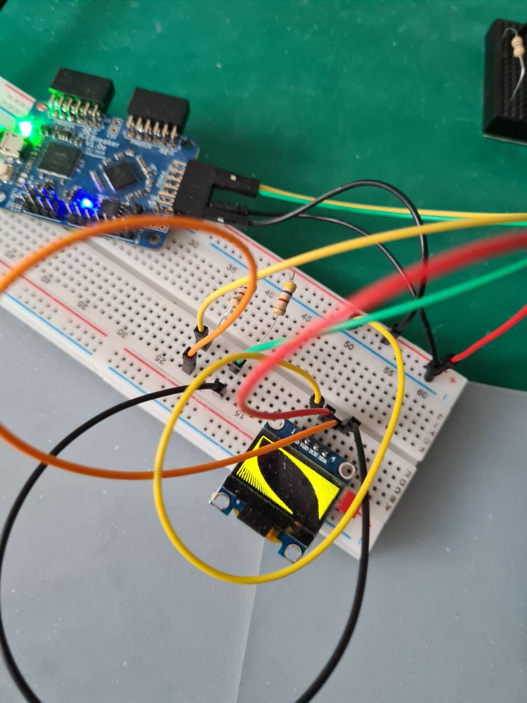

This is a fpga based implementation of a i2c ssd1306 oled bresenham line
draw algorithm...it is just proof of concept
It contains an i2c master, framebuffer and bresenham gfx unit
works on sdd1306 128x64 display

Implementation for icebreaker and blackicemx to port this code is peace of cake.

run the Makefile.icebreaker or Makefile.blackicemx

[

Have fun,

Hirosh
